<div align="center">
  <h1>czleing-admin</h1>
  <h3>中后台管理系统配置化框架</h3>
</div>

## 简介
### Vue3.5 + Vite8 + Pinia3 + Ant-design-vue4 + JavaScript + axios + vue-router + pnpm

个人利用业余时间使用最新技术栈封装的一套后台管理前端开发框架，追求精简、优雅，没有个人的包名、前缀、广告，拿来免改，干净整洁，易懂易用易扩展，将常用的功能进行了灵活的封装，不再需要编写繁琐的表单、控件、校验、联动逻辑、获取数据逻辑、表单回填逻辑、数据转换逻辑、列表、弹窗等重复性代码，通过简单配置即可使用，部分约定大于配置，让开发尽量简单

## 环境要求
- node: 20+
- pnpm: 9+

## 相关技术及依赖
- Vue 3.5+ 开发框架
- Vite 8+ 打包构建，目前最快的构建工具
- [pinia 3.0](https://pinia.web3doc.top/) 全局状态管理，比 vuex 更简单好用
- ant-design-vue 4+ UI库，ant-design-vue 最新版，体验与颜值并存
- vue-router 5.1 路由管理
- [VueUse](https://vueuse.org/) 集成了很多组合式API的库
- axios 服务请求
- dayjs 日期处理(moment的简化版, ant-design-vue 4 默认的日期处理工具)
- pinia-plugin-persist pinia持久化插件，
- unplugin-auto-import 常用API免导入插件，如使用 ref, reactive 不在需要写 import { ref, reactive } from 'vue'
- pnpm 包管理工具，目前最优的包管理工具，更快速且体积更小
- [后端源码](https://gitee.com/czleing/base-backend-api) 基于若依单体后端修改

## 框架功能及特点
- 主题色动态切换(使用 CSS 变量 + ThemeToken 双方案)
- 全局明/暗色模式
- 统一动态调整组件大小
- 使用动态路由及权限配置(按钮级功能权限 + 数据权限)
- 统一接口异常拦截及处理
- 统一路由拦截及校验
- 多种菜单布局方式
- 支持标签栏展示多个页面
- 支持多级路由缓存及刷新
- 最新技术、前后端分离
- 使用 JavaScript
- 支持国际化(vue-i18n按模块配置)
- 线上自动检测版本更新
- CRUD 配置化自动生成，告别传统的大量DOM重复堆砌
- 系统管理基础功能
- 集成SSE消息通知
- Swagger 接口文档(入口：打开菜单：开发中心 -> 接口文档)
- CRUD 可视化代码生成
- 一个CRUD页面只有一个文件，不用到处跳，开发不割裂，代码简短，如：一个部门管理只需几十行代码，一个用户管理也仅200多行，菜单管理300多行
- ==========================
- 未来持续更新
- 接下来实现定时任务设置、用户的权限角色双向设置等...

## 初始化
### 1. 安装依赖
```
 pnpm i
```
### 2. 本地启动
```
npm run dev
```
### 3. 访问 http://127.0.0.1:3000/

### 4. 默认登录账号密码：
admin/123456

### 5. 打包
```
npm run build

```
### 6. 本地预览打包结果
```
npm run preview
```

## 预览

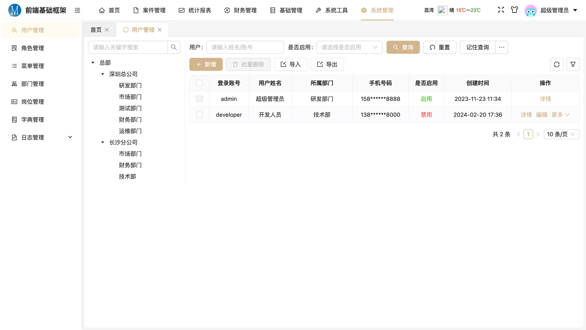
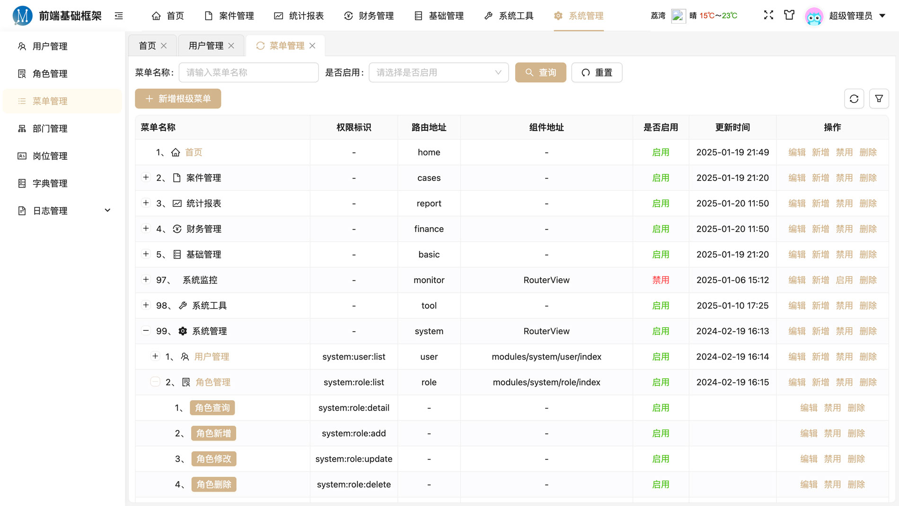
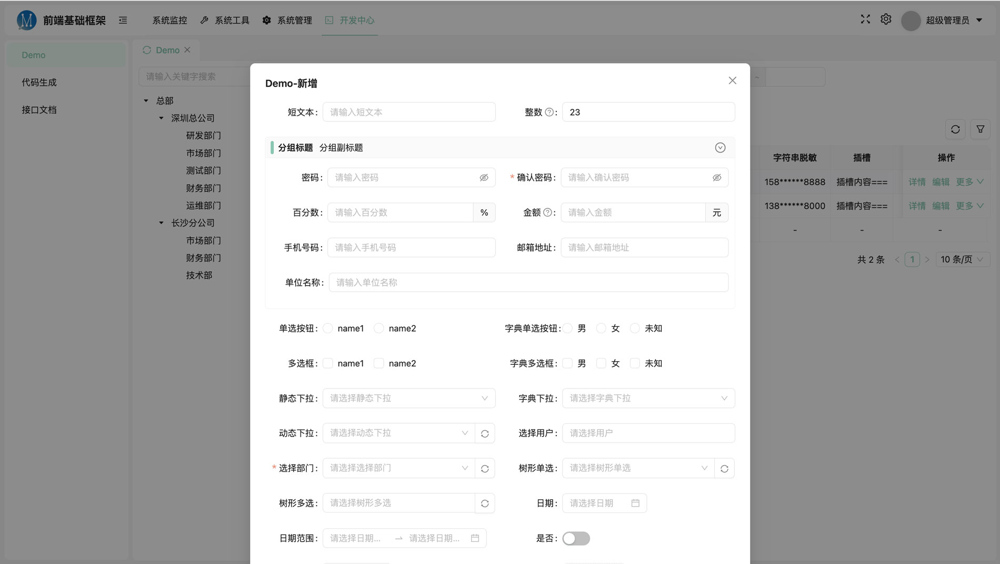
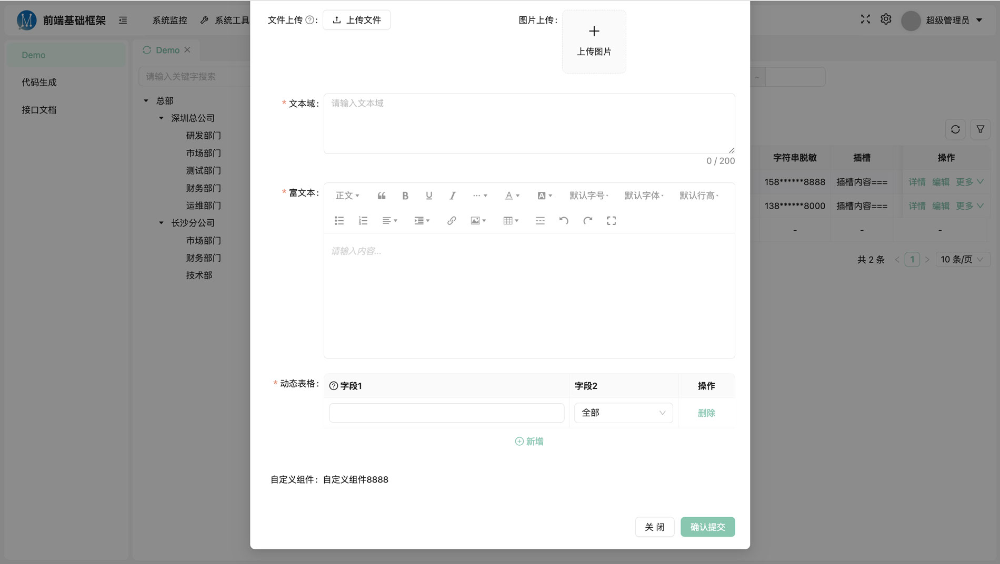
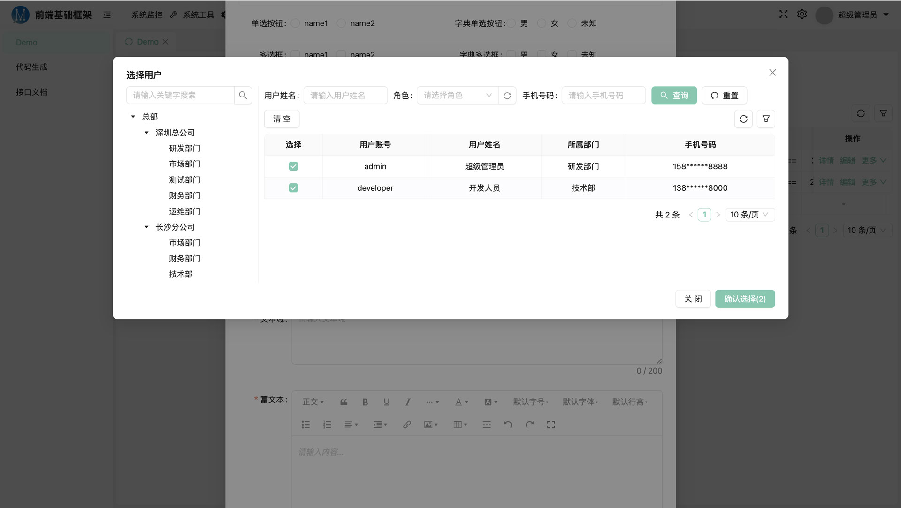
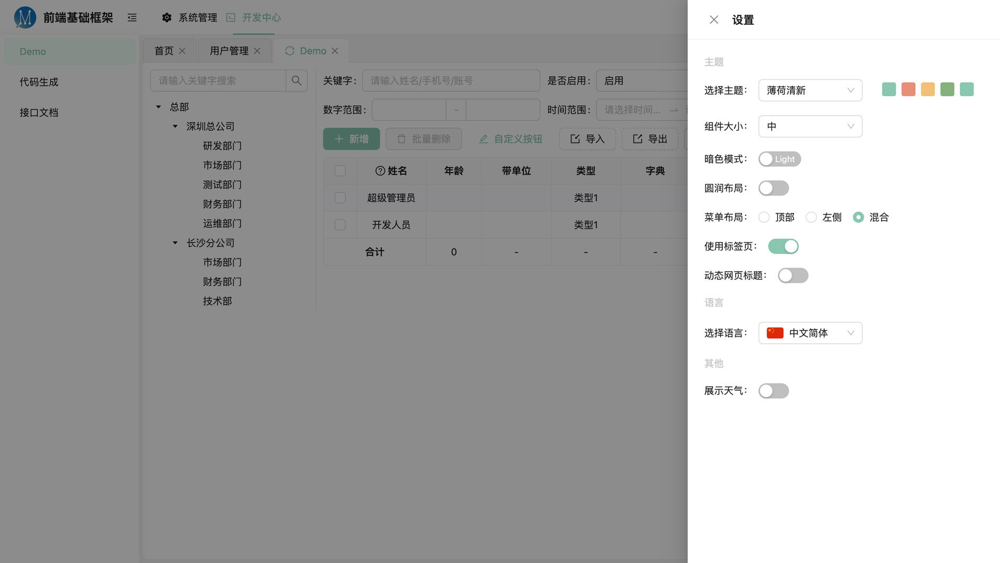
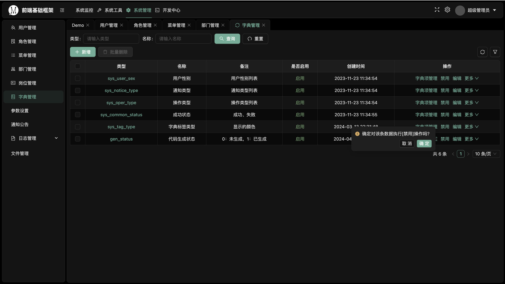
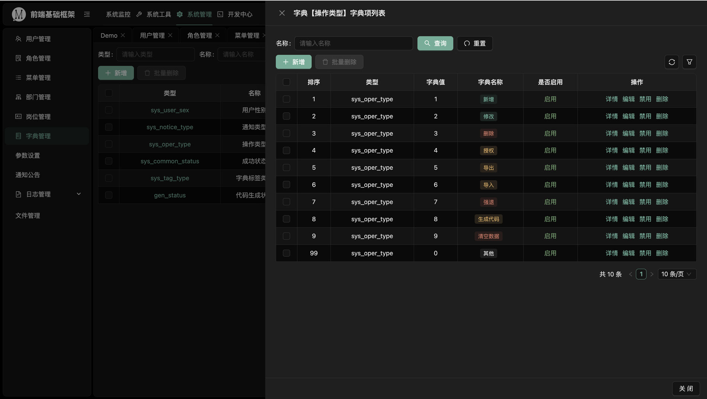

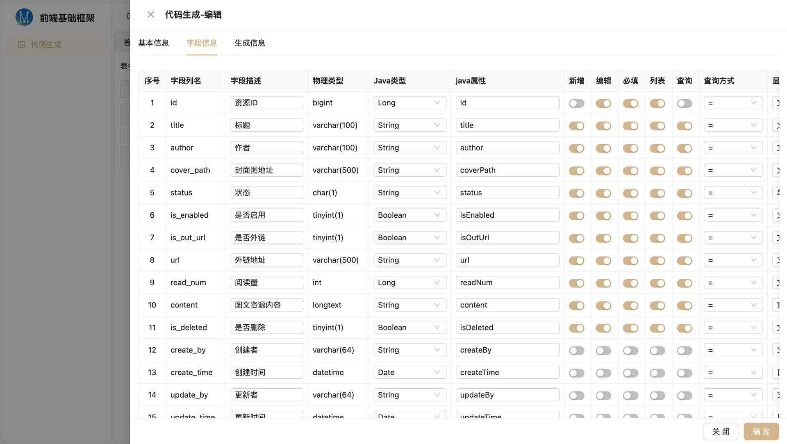
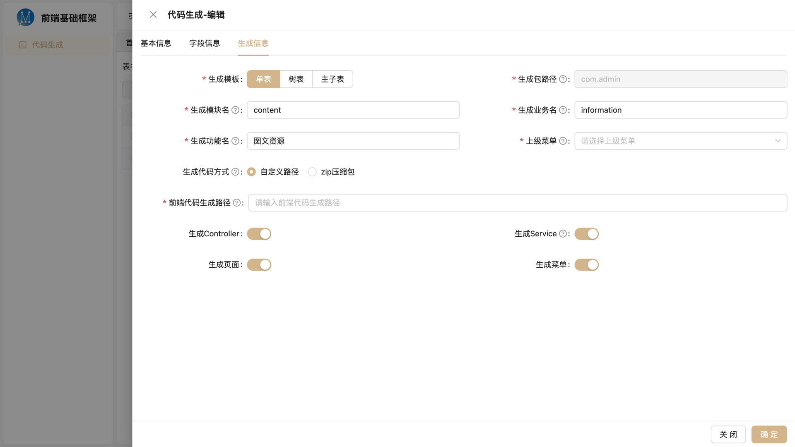
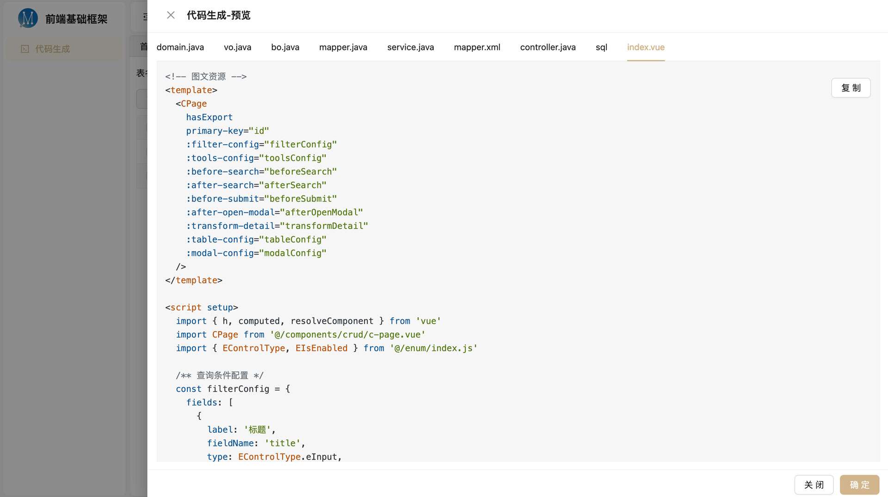

## 其他说明
### 1、规范
- 请保持项目目录/文件干净整洁、风格统一
- 编写组件或页面文件首行请注明该组件/页面的说明、用途、用法等
- 使用两个空格代替缩进符，避免不同系统下缩进宽度不一致
- 避免在模板中写复杂逻辑，应仅包含简单的属性绑定，避免写复杂的表达式或函数调用，保持模板清晰
- 给组件添加属性时，遵守一定的优先顺序，指令 > 动/静态属性 > 事件，
  如：`<input v-if="xxx" :maxlength="30" class="xxx" @input="onInputHandle" />`
- 组件中 style 标签尽可能添加 `scoped`，避免全局样式污染，如：`<style scoped>`
- 查询区域/表单区域使用日期/时间范围时，字段名设计统一使用'Begin'、'End'后缀，便于代码生成及使用默认值简化配置，如：xxxBegin, xxxEnd
- 相对独立的小模块，尽可能单独抽离成一个组件，避免一个文件代码过长过杂，同时也要避免过多的组件嵌套


### 2、接口请求
接口请求摒弃了`restfull`规范及一接口一封装模式，而是采用通用的请求方式，method 统一使用 post，参数统一使用请求体传参，如：
```javascript
import api from '@/api'
...
const goodsList = await api.post('/goods/list', { priceRange: [10, 100] })
```
#### 请求
- 第一个参数为接口地址，第二个参数为请求参数，第三个参数为其他配置，可选，如 headers, content-type 的设置
- Content-Type 统一为 application/json，一般情况无需设置
- method 统一为 post
- 传参位置：
- get 请求，请求参数统一通过 params 传递(URL传参)
- post、put、delete、download 请求，请求参数统一通过 data(request body) 传递(请求体传参)
- 不存在同时设置两种参数，除非手动拼在URL后面(不推荐)
- 统一 post 的好处是在对接接口时，只需关注 url 和 参数，不用关注 method、content-type、传参位置等其他内容，以及省去数据来回的类型转换，提高沟通和开发效率

#### 响应
- 框架对 axios 的二次封装，简化了获取响应数据步骤，对全局异常统一拦截处理，使业务不需要关注全局异常处理，全局异常如：未登录或登录失效、未绑定手机号码、用户状态异常等
- <font color="orange">【局部异常：需要前端个别地方特殊处理的业务异常】请按正常状态(200)返回，将异常信息放在 data 里，避免被统一拦截<br/>【全局异常：前端统一处理的异常】直接返回4xx,5xx,6xx等状态，在响应拦截器中统一处理，如重新登录、业务异常错误提示</font>
- 返回结果就是业务数据，不用再每次请求都要通过一堆的 `.data` 去获取业务数据

### 3、样式
- 框架中自带了一套基础样式库(原子样式)：`@/assets/css/base.less`，基本可以覆盖90%的场景，无法覆盖的单独写样式即可
- less 中可使用 ant-design 的全局静态变量 @colorPrimary 等，但此变量不会跟随主题动态切换而变化，
需要跟随变化请使用动态方式获取，token 内部的变量名参考[官网](https://www.antdv.com/docs/vue/customize-theme-cn)，如下：
```js
import { useThemeToken } from '@/hooks/useThemeToken.js'
const { token } = useThemeToken()
// 获取动态颜色
token.value.colorPrimary
token.value.colorWarning
token.value.colorSuccess
...
```
或者使用全局 css 变量，css 变量根据主题切换动态变化，变量参考 `layout/index.vue`
```
--ant-colorText
--ant-colorInfo
...
```


### 4、获取当前登录用户
```javascript
import { useAuthStore } from '@/stores/auth-store.js'

const authStore = useAuthStore()
// 用户信息
console.log('当前登录用户：', authStore.userInfo)
```

### 5、权限控制
使用自定义指令 `v-hasPermi`、`v-noPermi`

```html
<a-button v-hasPermi="'system:user:add'">新增</a-button>
<a-button v-hasPermi="['xxx:xxx:xxx1', 'xxx:xxx:xxx2']">新增</a-button>
```

### 6、字典使用
- CRUD 配置中使用，系统CRUD各部分组件已经深度集成了字典功能，在首次需要时加载，加载过的字典会缓存在内存中，避免频繁、重复加载，更新策略：刷新页面、手动点击刷新按钮、通过 useDict 第三个参数配置强制加载，dict-store 中提供了手动刷新方法：getDatasByType
```javascript
  // 表单组件中使用
  {
    label: '字典下拉',
    fieldName: 'xxxStatus',
    type: EControlType.eSelect,
    props: {
      dictType: 'xxx_status' // 指定字典类型，自动查询出字典项数据
    }
  }
  // 列表 column 中使用
  {
    title: 'xx状态',
    dataIndex: 'status',
    width: 100,
    dictType: 'xxx_status' // 自动按指定的字典类型解析出名称
  },
```

- 独立使用，通过 `useDict`
```javascript
import { useDict } from '@/hooks/useDict.js'
// 用法一：
const dict = useDict(['is_delete', 'audit_status'])

dict['audit_status'] // 异步赋值 reactive 响应式对象 dict

// 用法二：
useDict(['audit_status'], dict => {
  console.log(dict['audit_status'])
})

<!-- 字典解析全局组件，支持多个值 -->
<DictView dictType="audit_status" value="1,2" />
```


### 7、弹出模态框（简化版）
全局组件 `/global/CModal` 对 a-modal、a-drawer 进行了合并封装，简化了使用，属性设置支持标签上设置和调用时设置
```html
<template>
  <div>
    xxx
    <CModal ref="cModal" title="xxx" width="800" :onConfirm="onConfirm"...>
      弹出框内部内容
    </CModal>
  </div>
</template>

<script setup>
const cModal = ref()
function openModal () {
  cModal.value.open({
    title: '弹窗标题',
    mode: 'modal', // 弹窗类型，modal | drawer
    width: 600, // 弹窗宽度
    showConfirm: true, // 是否需要确认按钮，默认需要
    // ... 其他属性，参考 src/components/global/CModal/index.vue
    async onConfirm (close) {}, // 点击确认按钮时执行，调用 close() 关闭弹窗
    async onCancel () {} // 点击取消时执行
  }, extraData)
  // 关闭弹窗
  // cModal.value.close()
}
// 也可以通过传入一个函数来执行确认操作，extraData 为调用open时传入的附加数据
function onConfirm (close, extraData) {
}
</script>
```


### 8、CRUD快速开发案例(可直接代码生成，菜单：开发中心->代码生成)
#### 步骤一：先在数据库中设计表结构
#### 步骤二：然后本地启动进入菜单‘开发中心->代码生成’导入表并编辑相关信息
#### 步骤三：预览并一键生成菜单及CRUD前后端代码
#### 步骤四：查看生成结果或对特殊字段、控件的属性进行自定义修改

#### 8.1、CRUD 简单案例：
```html
<!-- xxx管理 -->
<template>
  <!-- 预设功能 API、权限 默认根据路由动态生成，可不配 -->
  <CPage
    :filter-config="filterConfig"
    :table-config="tableConfig"
    :modal-config="modalConfig"
  />
</template>

<script setup>
  import CPage from '@/components/crud/c-page.vue'

  /** 查询条件配置 */
  const filterConfig = {
    fields: [
      { label: '编码', fieldName: 'postCode' }, // 不写 type，默认 Input
      { label: '名称', fieldName: 'postName' },
      { label: '是否启用', fieldName: 'isEnabled', type: EControlType.eSelect, props: { options: EIsEnabled._list } }
    ]
  }

  /** 数据列表配置 */
  const tableConfig = {
    columns: [
      { title: '编码', dataIndex: 'postCode' },
      { title: '名称', dataIndex: 'postName' },
      { title: '是否启用', dataIndex: 'isEnabled', type: 'isEnabled' },
      {
        title: '操作',
        actionShowNum: 2, // 展示操作按钮数量，剩余的将收进更多里
        action: ({ record }) => [
          // 预设：edit, detail, delete, toggle，预设功能 callback 可以直接写字符串
          { name: '详情', callback: 'detail' },
          { name: '编辑', callback: 'edit' },
          { name: '删除', callback: 'delete' }, // 删除操作默认带确认框
          { name: record.isEnabled ? '禁用' : '启用', confirm: true, callback: 'toggle' }
        ]
      }
    ]
  }

  /** 新增、修改、详情弹窗配置 */
  const modalConfig = {
    title: 'xx信息', // 弹窗标题，会自动根据类型拼上新增、编辑、详情关键字
    // width: 700, // 弹窗宽度，默认 600
    // mode: 'modal', // 弹窗模式, modal 或 drawer
    formConfig: {
      cols: 2, // 一行显示几列
      fields: [ // 表单字段，可分租
        { label: '编码', fieldName: 'postCode', required: true }, // 不写 type，默认 Input
        { label: '名称', fieldName: 'postName', required: true }, // 不写 type，默认 Input
      ]
    }
  }
</script>
```

#### 9.2、配置完整参考案例：[demo-page.vue](https://gitee.com/czleing/base-backend-static/blob/master/src/views/demo/demo-page.vue)


与传统开发模式对比：
```html
<!-- 传统的写法，需要编写大量 Dom 和 js -->
...
<el-form-item label="选择xxx" prop="xxxId" required :rules="[xxx]">
  <el-select
    v-model="formData.xxxId"
    placeholder="请选择xxx"
    @change="onXxxChange"
  >
    <el-option
      v-for="tem in xxxList"
      :key="tem.id"
      :label="tem.name"
      :value="tem.id"
    />
  </el-select>
</el-form-item>
...
<script setup>
import axios from '@/api'
const xxxList = ref()
async function getXxxList (type = 1) {
  xxxList.value = await axios.post('/api/xxx/select', { type })
}
// type 变化时，重新请求下拉框数据
function onTypeChange (type) {
  getXxxList(type)
}


/**
 * 本框架写法，只需编写 js，并自动匹配新增、修改、详情三种模式
 */
...
{
  label: '选择xxx',
  fieldName: 'xxxId',
  type: EControlType.eSelect,
  rules: [xxx],
  required: true,
  props: {
    remote: {
      url: '/api/xxx/select',
      params: {
        type: '{formData.type}' // 使用'{}'，自动监听表单的 type 字段，变化时，重新获取数据
      },
      ...
    },
    onChange (id, option, formData) {}
  }
}
...
</script>
```
### 9、表单联动方式
#### 在表单配置中
```javascript
/**
 * 新增、修改、详情弹窗配置
 */
const modalConfig = computed(() => ({
  // ... 省略其他配置
  // 表单配置 Object || ({ isAdd, isEdit, isView, detail }) => Object
  formConfig: ({ isAdd, isEdit, isView, detail }) => ({
    labelCol: { span: 6 },
    wrapperCol: { span: 18 },
    cols: 2, // 一行显示几列，默认 2 列
    // 表单字段
    fields: [ // 表单字段数组，可分组
      {
        label: (formData) => formData.type === 1 ? '商品名称' : '赠品名称', // String | formData => String
        fieldName: 'productName', // 字段名，暂不支持函数
        type: EControlType.eInput, // 控件类型，暂不支持函数，详情时组件会以纯文本渲染
        required: (formData) => formData.type === 1, // Boolean | (formData) => Boolean
        disabled: isEdit, // 是否禁用, Boolean | (formData) => Boolean
        // hidden: isView, // 是否隐藏该字段，数据仍在表单中，Boolean | formData => Boolean
        // none: isView, // 是否不需要该字段，数据不在表单中，Boolean | formData => Boolean
        rules: (formData) => [{}], // 通过函数，动态生成校验规则 Object | Array | (formData) => Object | Array
        extra: formData => 'xxx', // 字段额外说明， String | formData => String
        tooltip: formData => 'xxx', // 字段提示， String | formData => String
        defaultValue: 'xxx', // 默认值，暂不支持函数
        props: { // 控件属性
          placeholder: formData => 'xxx', // 通过 formData 动态生成，String | formData => String
          onChange (val, formData) { // 所有控件都有 onChange 事件，都能拿到 formData，但是不同控件，入参个数及顺序有区别
            // 通过 formData 修改其他表单项的值，实现联动
            if (val.length > 5) {
              formData.xxx = 'xxx'
            }
          }
        }
      },
      // ...其他字段
    ]
  })
}))
```

## 贡献者


czleing

## 感谢支持
开源不易，如果觉得对您有帮助，可以帮忙点个 Star, 感激不尽！

或者还可以小费打赏哦 ^_^

<div>
微信　　　　　　　　　支付宝
</div>


