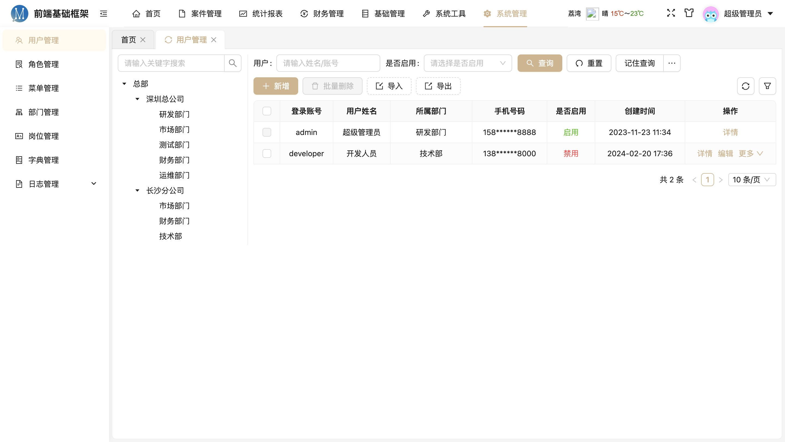
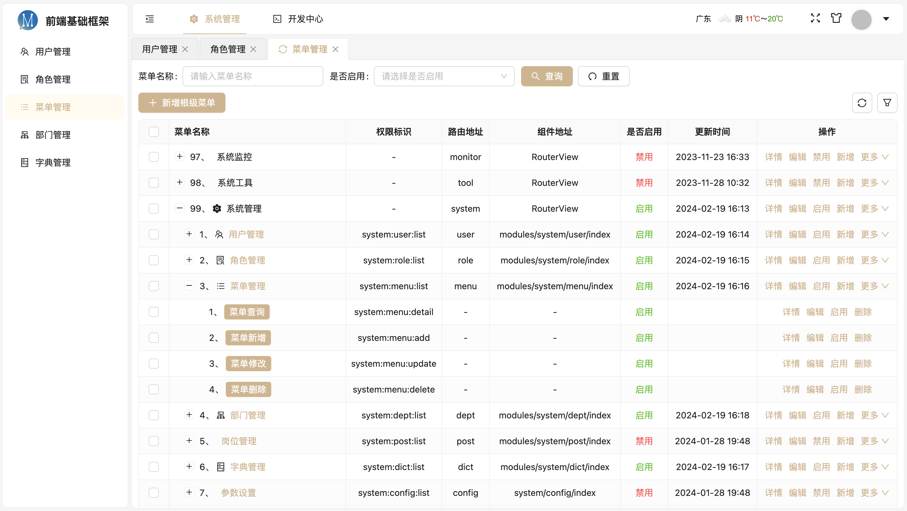
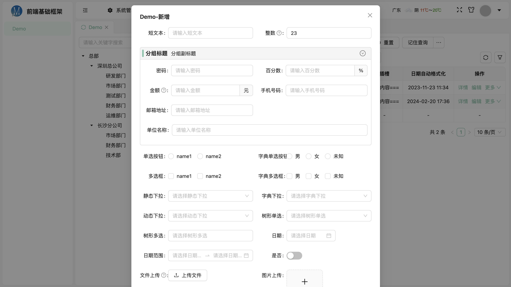
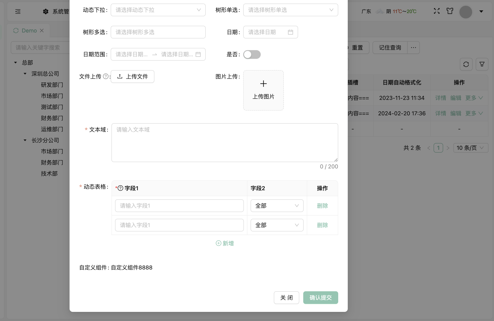
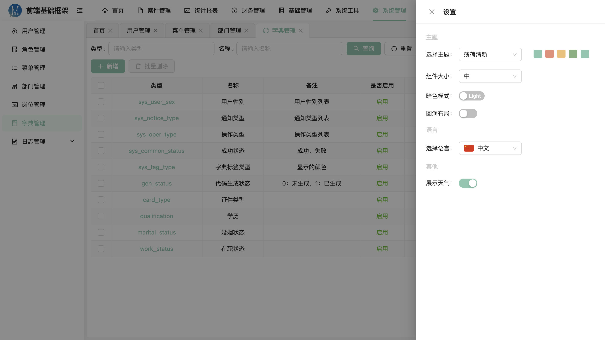
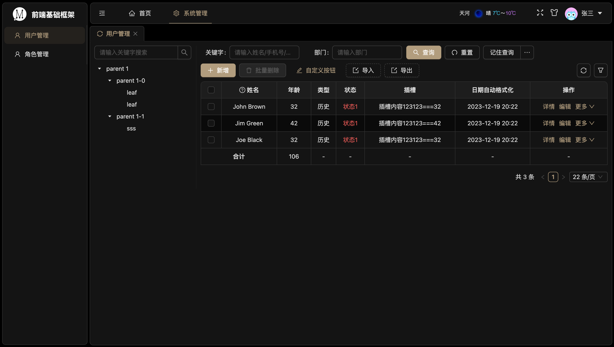
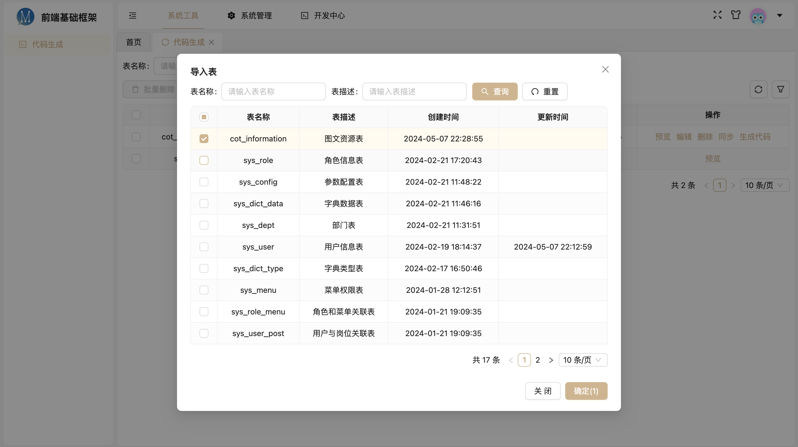
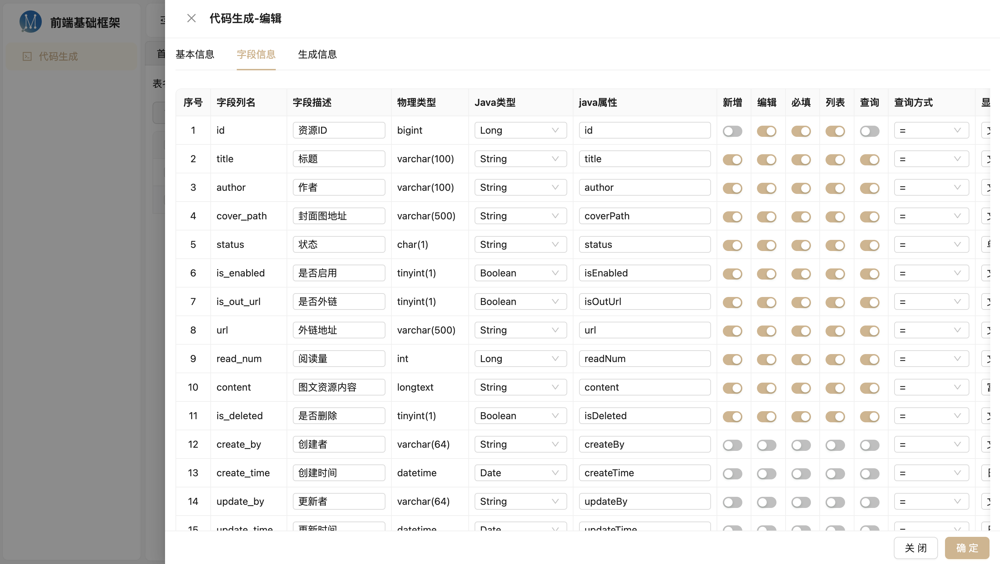
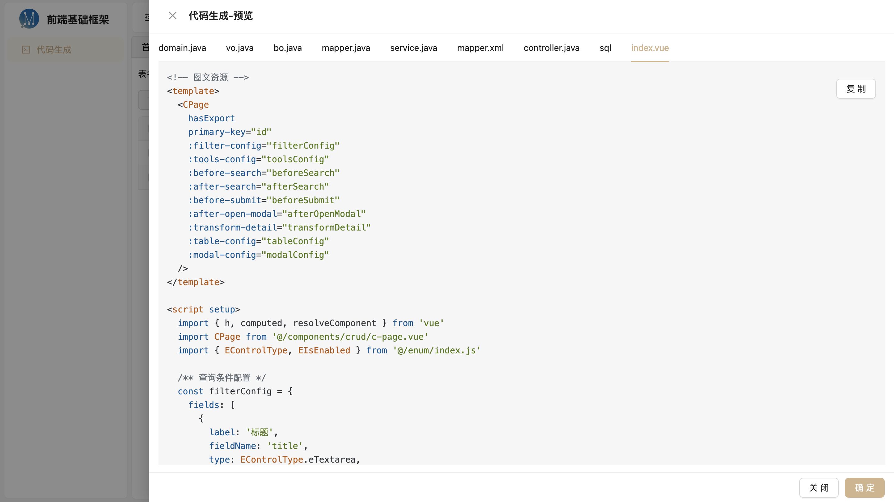

# Vue3 + Vite + Pinia + Ant-design-vue4 + JavaScript + axios + vue-router + pnpm

使用最新技术栈封装的一套后台管理前端开发框架，追求精简、优雅，没有多余的代码和依赖，没有个人的包名、前缀、广告，拿来免改，干净整洁，易懂易用易扩展，将常用的功能进行了非常灵活的封装，通过配置来使用，个别地方约定大于配置，让开发尽量简单

## 环境要求
- node: 18+
- pnpm: 9+

## 相关技术及依赖
- Vue 3.4+ 开发框架
- Vite 4.4+ 打包构建，目前最快的构建工具
- [pinia 2.1+](https://pinia.web3doc.top/) 全局状态管理，比 vuex 简单好用
- ant-design-vue 4+ UI库，ant-design-vue 最新版，体验与颜值并存，完胜 ElementPlus
- vue-router 4.4+ 路由管理
- [VueUse](https://vueuse.org/) 集成了很多组合式API的库
- axios 服务请求
- dayjs 日期处理(moment的简化版, ant-design-vue 4 默认的日期处理工具)
- pinia-plugin-persist pinia持久化插件，
- pnpm 包管理工具，目前最优的包管理工具，更快速且体积更小
- [后端源码](https://gitee.com/czleing/base-backend-api)

## 框架功能及特点
- 主题色动态切换
- 全局明/暗色模式
- 统一动态调整组件大小
- 使用动态路由及权限配置
- 统一接口异常拦截及处理
- 统一路由拦截及校验
- 采用顶部一级菜单和左侧子菜单布局
- 支持 Tab 栏展示多个页面
- 支持多级路由缓存及刷新
- 最新技术、前后端分离
- 代码简洁、清爽、优雅
- 使用 JavaScript
- 可支持国际化(引入vue-i18n)
- 线上自动检测版本更新
- CRUD 配置化开发
- 系统管理基础功能
- CRUD 可视化代码生成

## 初始化
### 1. 安装依赖
```
 pnpm i
```
### 2. 本地启动
```
npm run dev
```
### 3. 停止本地服务，用 q 不用 Ctrl + C
```
q
```

## 打包
```
npm run build
```

## 预览











## 其他说明
### 1、动态样式
less 中可使用 ant-design 的全局静态变量 @colorPrimary 等，但此变量不会跟随主题动态切换而变化，需要跟随变化请使用动态方式获取，token 内部的变量名参考[官网](https://www.antdv.com/docs/vue/customize-theme-cn)，如下：
```js
import { useThemeToken } from '@/hooks/useThemeToken.js'
const { token } = useThemeToken()
// 获取动态颜色
token.value.colorPrimary
token.value.colorWarning
token.value.colorSuccess
...
```

### 2、CRUD快速开发案例(可直接代码生成，系统工具->代码生成)
参考 /src/views/demo/demo-page.vue
```vue
<!-- CRUD 开发案例 -->
<template>
  <CPage
    hasImport
    hasExport
    hasGoBack
    primary-key="id"
    primary-key-说明="primary-key 指定主键的字段名，默认：id"
    :api-config="{
      // 预设功能接口地址配置，默认根据当前路由生成，如新增接口：路由：/system/user => 接口：/system/user/add
      // add: '',
      // update: '',
      // detail: '',
      // delete: '',
      // list: '',
      // toggle: '',
      // import: '',
      // importTemplate: '',
      // export: ''
    }"
    :api-method-config="{
      // 预设功能接口请求方式设置，默认全部post
      // add: '',
      // update: '',
      // detail: '',
      // delete: '',
      // list: '',
      // toggle: '',
      // import: '',
      // importTemplate: '',
      // export: ''
    }"
    :permission-config="{
      // 预设功能权限配置，默认根据当前路由生成，如：/system/user -> system:user:add
      // add: '',
      // update: '',
      // detail: '',
      // delete: '',
      // list: '',
      // toggle: '',
      // import: '',
      // importTemplate: '',
      // export: ''
    }"
    :tree-config="treeConfig"
    :filter-config="filterConfig"
    :tools-config="toolsConfig"
    :before-search="beforeSearch"
    :after-search="afterSearch"
    :before-submit="beforeSubmit"
    :after-open-modal="afterOpenModal"
    :transform-detail="transformDetail"
    :table-config="tableConfig"
    :modal-config="modalConfig"
  >
    <!-- 表格单元格内容过于复杂时，可以使用插槽 -->
    <template #table_slotField="{ text, record, index, column }">
      插槽内容==={{ record.age }}
    </template>
  </CPage>
</template>

<script setup>
import { h, computed } from 'vue'
import CPage from '@/components/crud/c-page.vue'
import { EControlType, EIsEnabled } from '@/enum/index.js'

/** 左侧树形配置，不配置则不使用树 */
const treeConfig = {
  url: '/system/user/deptTree',
  // method: 'post',
  replaceField: { key: 'id', children: 'children', title: 'label' },
  searchField: 'deptId', // 将选中节点的id作为列表的查询参数的参数名，默认orgId
}
/** 查询条件配置 */
const filterConfig = {
  // useCache: true, // 使用查询条件暂存
  // cacheBtnText: '记住查询', // 暂存按钮文字，默认 '记住查询'
  // labelCol: { span: 8 },
  // wrapperCol: { span: 16 },
  fields: [
    {
      label: '关键字',
      fieldName: 'key',
      type: EControlType.eInput,
      // labelCol: { span: 7 },
      // wrapperCol: { span: 18 },
      props: {
        placeholder: '请输入姓名/手机号/账号'
      }
    },
    {
      label: '是否启用',
      fieldName: 'isEnabled',
      type: EControlType.eSelect,
      props: {
        options: EIsEnabled._list
      }
    }
  ]
}
/** 自定义工具栏按钮配置 */
const toolsConfig = {
  // addBtnText: '新增',
  // backBtnText: '返回',
  otherToolsBtns: [
    {
      name: '自定义按钮',
      permission: 'system:user:diy',
      props: {
        type: 'link',
        icon: 'EditOutlined',
        disabled: ({ selectedIds, selectedObjs, pagination }) => selectedObjs.some(item => item.status === 1),
        onClick ({ selectedIds, selectedObjs, pagination }) {
          console.log('我被点击了')
        }
      }
    }
  ]
}
/** 数据列表配置 */
const tableConfig = computed(() => ({
  props: {
    // 参考 a-table props
    // bordered: true, // 是否使用边框线，默认使用
    // size: 'small', // 组件尺寸，默认 small
    // pageSize: 22, // 重写分页大小选项
    // usePage: false, // 不使用分页，默认使用
    // rowClick (record, index, selected) { // 配置数据行点击事件
    //   console.log(record, index)
    // }
  },
  initSearch: true, // 默认 true，初始化时查询
  columns: [
    {
      title: '姓名',
      tooltip: '用户真实姓名',
      dataIndex: 'nickName',
      resizable: true,
      width: 100
    },
    {
      title: '年龄',
      dataIndex: 'age',
      resizable: true,
      width: 80,
      minWidth: 40,
      maxWidth: 200,
      useTotal: true // 使用合计
    },
    {
      title: '名称2',
      dataIndex: 'name2',
      hidden: true // 该列暂时隐藏，可通过列筛选勾选显示
    },
    {
      title: '类型',
      dataIndex: 'type2',
      customRender: value => '历史'
    },
    {
      title: '字典',
      dataIndex: 'dict',
      dictType: 'dict_type' // 自动按指定的字典类型解析出中文
    },
    {
      title: '状态',
      dataIndex: 'status',
      customRender: ({ value, record, index, column }) => { // 自定义渲染函数
        return h('span', {
          class: 'text-danger'
        }, '状态1')
      }
    },
    {
      title: '是否启用',
      dataIndex: 'isEnabled',
      type: 'isEnabled' // type 预处理类型，isEnabled，格式化为是否启用
    },
    {
      title: '字符串脱敏',
      dataIndex: 'phonenumber',
      hideChar: [3, 4, '*'] // 字符串脱敏，第一个值为左边显示字符数，第二个参数为右边显示字符数，剩下的使用第三个参数代替，默认'*'可不传
    },
    {
      title: '地址',
      dataIndex: 'address',
      hidden: true,
      width: 180,
      ellipsis: true // ant-design 自带的超出宽度隐藏
    },
    {
      title: '插槽',
      dataIndex: 'slotField',
      slot: 'table_slotField' // 使用插槽渲染
    },
    {
      title: '日期自动格式化',
      dataIndex: 'createTime',
      // isDate: true, // 自动格式化为 YYYY-MM-DD
      isDateTime: true, // 或 自动格式化为 YYYY-MM-DD HH:mm
      // dateFormat: 'YYYY-MM-DD HH:mm:ss' // 或 自定义格式
    },
    {
      title: '操作',
      actionShowNum: 2, // 展示操作按钮数量，剩余的将收进更多里
      actionMoreText: '更多', // 更多按钮名称，默认"更多"
      // action: 操作列配置，T[] || ({ record }) => T[]
      action: ({ record }) => {
        const btns = [
          // 预设：edit, detail, delete, toggle
          {
            name: '详情',
            callback: 'detail'
          },
          {
            name: '编辑',
            callback: 'edit'
          },
          {
            name: '删除',
            callback: 'delete' // 删除操作默认带确认框
          },
          {
            name: record.isEnabled ? '启用' : '禁用',
            confirm: true,
            callback: 'toggle'
          },
          // {
          //   name: '自定义',
          //   permission: 'system:user:diy',
          //   confirm: true, // 该操作是否需要确认操作
          //   confirmContent: '', // 确认框提示内容，不填则使用默认模板
          //   callback ({}) {
          //     console.log('我被点击了', record)
          //   }
          // },
          // 更自由的自定义
          // {
          //   name: '自定义2', // 操作名称，当使用了 confirm: true 后，用于提示中显示，不使用 confirm 可不设置
          //   permission: 'system:user:diy2',
          //   confirm: true,
          //   customRender: data => {
          //     return h('span', { class: '' }, '自定义2') // 定义元素外观
          //   },
          //   callback () { // 点击事件还是使用 callback (方便确认框点击确定时调用)
          //     console.log('自定义2被点击了')
          //   }
          // }
        ]
        if (record.age > 35) {
          btns.push({
            name: '辞退',
            permission: 'system:user:getout',
            confirm: true,
            confirmContent: `确认要辞退${record.name}吗？`,
            callback ({}) {
              console.log(record.name + '被辞退了')
            }
          })
        }
        return btns
      }
    }
  ]
}))
/**
 * 新增、修改、详情弹窗配置
 */
const modalConfig = computed(() => ({
  title: 'Demo', // 弹窗标题，会自动根据类型拼上新增、编辑、详情关键字
  // fullTitle: '', // 全称，不会自动拼接其他字符串
  width: 700, // 弹窗宽度，默认 600
  mode: 'modal', // 弹窗模式, modal 或 drawer
  // 弹窗按钮属性修改 Object || ({ isAdd, isEdit, isView }) => Object
  buttonConfig: ({ isAdd, isEdit, isView }) => ({
    confirmText: isEdit ? '确认修改' : '确认提交', // 默认是确定
    cancelText: '关闭', // 默认是关闭
    // showConfirm: !isEdit // 确认按钮是否可见，默认可见
    // showCancel: !isEdit // 取消按钮是否可见，默认可见
  }),
  // 表单配置 Object || ({ isAdd, isEdit, isView, detail }) => Object
  formConfig: ({ isAdd, isEdit, isView, detail }) => ({
    labelCol: { span: 6 },
    wrapperCol: { span: 18 },
    colSize: 2, // 一行显示几列
    // 表单字段
    fields: [ // 表单字段数组，可分组
      {
        label: '短文本',
        fieldName: 'shortText',
        type: EControlType.eInput,
        // required: true,
        props: {
          allowClear: true
        }
      },
      {
        label: formData => '整数', // 字段描述 String || formData => String
        fieldName: 'int',
        type: EControlType.eNumber,
        tooltip: formData => '111', // 字段提示， String || formData => String
        // extra: formData => '222', // 字段额外说明， String || formData => String
        // required: true, // 是否必填，Boolean || formData => Boolean
        defaultValue: 23,
        // disabled: formData => !formData.userName, // 组件是否禁用，Boolean || formData => Boolean
        // rules: [], // object || array
        props: {
          precision: 0,
          min: 1,
          max: 100
          // placeholder: '请输入年龄', // 默认"请输入+label"， String || formData => String
          // onChange (val) {}
        } // 控件其他属性，所有控件都支持 onChange 事件
      },
      {
        // 字段分组
        title: '分组标题', // String || formData => String
        subTitle: '分组副标题', // String || formData => String
        // none: formData => !formData.userName, // true表示该项不可见(不使用该字段)，Boolean || formData => Boolean
        fields: [
          {
            label: '密码',
            fieldName: 'password',
            type: EControlType.eInput,
            rules: { pattern: /^[\d\w!@#$%\^&*()]{8,16}$/, message: '密码格式错误，应8-16位数字、字母、!@#$%^&*()特殊符号' },
            none: isView, // 详情时不展示该字段
            props: {
              type: 'password',
              maxlength: 16
            }
          },
          {
            label: '百分数',
            fieldName: 'persent',
            type: EControlType.eNumber,
            // required: true,
            props: {
              addonAfter: '%',
              precision: 2,
              min: 0,
              max: 100
            }
          },
          {
            label: '金额',
            fieldName: 'amount',
            type: EControlType.eNumber,
            // required: true,
            tooltip: '描述XXXXXXXX',
            props: {
              addonAfter: '元',
              precision: 2,
              max: 100,
              min: 0
            }
          },
          {
            label: '手机号码',
            fieldName: 'mobile',
            type: EControlType.eInput,
            // required: true,
            rules: {
              pattern: new RegExp(/^1[3456789]\d{9}$/),
              message: '请输入正确的手机号码',
              trigger: 'change'
            },
            props: {
              maxlength: 11
            }
          },
          {
            label: '邮箱地址',
            fieldName: 'email',
            type: EControlType.eInput,
            // required: true,
            rules: {
              type: 'email',
              message: '请输入正确的邮箱地址',
              trigger: 'change'
            },
            props: {
            }
          },
          {
            label: '单位名称',
            fieldName: 'unitName',
            type: EControlType.eInput,
            singleLine: true, // 单独占一行
            labelCol: { span: 3 },
            wrapperCol: { span: 21 },
            props: {},
            detailConfig: { // detailConfig 详情时的配置，可对上面(详情时有效的属性)覆盖
              labelCol: undefined,
              wrapperCol: undefined,
              singleLine: false // 如：详情时不单独占一行，或者更换控件类型等
            }
          },
        ]
      },
      {
        label: '单选按钮',
        fieldName: 'radio',
        type: EControlType.eRadio,
        props: {
          options: [{ id: 1, name: 'name1' }, { id: 2, name: 'name2' }],
          // optionType: '', // option 类型， default | button
          // buttonStyle: '' // optionType 为 button 时，button 的风格样式, outline | solid
        }
      },
      {
        label: '字典单选按钮',
        fieldName: 'radio2',
        type: EControlType.eRadio,
        props: {
          dictType: 'sys_user_sex'
          // optionType: '', // option 类型， default | button
          // buttonStyle: '' // optionType 为 button 时，button 的风格样式, outline | solid
        }
      },
      {
        label: '多选框',
        fieldName: 'checkbox',
        type: EControlType.eCheckbox,
        props: {
          options: [{ id: 1, name: 'name1' }, { id: 2, name: 'name2' }]
        }
      },
      {
        label: '字典多选框',
        fieldName: 'checkbox2',
        type: EControlType.eCheckbox,
        props: {
          dictType: 'sys_user_sex'
        }
      },
      {
        label: '静态下拉',
        fieldName: 'staticSelect',
        type: EControlType.eSelect,
        props: {
          useAll: true, // 是否在前面添加全部
          // allowClear: true,
          options: [{ id: 1, name: 'name1' }, { id: 2, name: 'name2' }]
          // mode: '', // 下拉模式 'multiple' | 'tags' | 'combobox'
        }
      },
      {
        label: '字典下拉',
        fieldName: 'dictSelect',
        type: EControlType.eSelect,
        props: {
          useAll: true, // 是否在前面添加全部
          dictType: 'sys_user_sex',
          // allowClear: true,
          // mode: '', // 下拉模式 'multiple' | 'tags' | 'combobox'
        }
      },
      {
        label: '动态下拉',
        fieldName: 'dmSelect',
        type: EControlType.eSelect,
        props: {
          remote: {
            url: '/system/user/selectUser',
            // method: 'get', // 默认 post
            params: {
              // type: 1,
              type: '{formData.radio:required}' // 动态参数，formData代表表单数据，required代表是否必填，必填时，有值才获取数据源
            },
            converter (result) { // 对接口返回数据进行修改，转成 [{id, name, xxx}] 格式
              return result.list?.map(item => ({ id: item.userId, name: item.nickName }))
            }
          }
        }
      },
      {
        label: '树形单选',
        fieldName: 'tree',
        type: EControlType.eTreeSelect,
        props: {
          remote: {
            url: '/system/user/deptTree'
          },
          fieldNames: {
            value: 'id',
            title: 'label',
            children: 'children'
          }
        }
      },
      {
        label: '树形多选',
        fieldName: 'treeMul',
        type: EControlType.eTreeSelect,
        props: {
          remote: {
            url: '/system/user/deptTree'
          },
          treeCheckable: true,
          fieldNames: {
            value: 'id',
            title: 'label',
            children: 'children'
          }
        }
      },
      {
        label: '日期',
        fieldName: 'date',
        type: EControlType.eDate,
        props: {
          // showTime: true // 是否需要时分秒
          // onChange (val) { } // 改变事件
        }
      },
      {
        label: '日期范围',
        fieldName: 'dateRange',
        type: EControlType.eDateRange,
        props: {
          // showTime: true // 是否需要时分秒
          fieldNames: ['dateRangeStart', 'dataRangeEnd'] // 必须设置起止字段名，日期范围都是两个值，对应表单中两个字段
        }
      },
      {
        label: '是否',
        fieldName: 'switch',
        type: EControlType.eSwitch,
        props: {
        }
      },
      {
        label: '文件上传',
        fieldName: 'fileUpload',
        type: EControlType.eFileUpload,
        tooltip: '仅支持 zip/rar 文件',
        props: {
          accept: '.zip,.rar'
        }
      },
      {
        label: '图片上传',
        fieldName: 'imageUpload',
        type: EControlType.eImageUpload,
        props: {
        }
      },
      {
        label: '文本域',
        fieldName: 'remark',
        type: EControlType.eTextarea,
        required: true,
        singleLine: true,
        labelCol: { span: 3 },
        wrapperCol: { span: 21 },
        props: {
          // rows: 5,
          // maxlength: 100
        }
      },
      {
        label: '动态表格',
        fieldName: 'table',
        type: EControlType.eTable,
        labelCol: { span: 3 },
        wrapperCol: { span: 21 },
        singleLine: true,
        // required: true, // 无效配置，请配置在 props.columns 的每一项里
        // rules: {}, // 无效配置，请配置在 props.columns 的每一项里
        // 动态表格的校验规则，全部配置在 columns 内，只要有一个 column 的 required 为 true，则表示该项为必填项
        // 校验规则 只支持 required, validate: (index, value, record) => {} ()
        props: {
          // primaryKey: 'id',
          // maxNum: 10,
          columns: [
            {
              // 表格列字段参考 DynamicTable 的 props.columns
              title: '字段1',
              tooltip: '字段1描述',
              dataIndex: 'field1',
              type: EControlType.eInput,
              required: true,
              validate: (index, value) => {
                if (value.length < 3) {
                  // 错误时，return 'message'
                  return `第${ index + 1 }行字段1长度不能小于3`
                }
                // 正确时无需返回
              }
            },
            {
              title: '字段2',
              dataIndex: 'field2',
              type: EControlType.eSelect,
              props: {
                useAll: true,
                options: [{id: 1, name: 1}]
              }
            }
          ]
        }
      },
      {
        label: '自定义组件',
        fieldName: 'custom',
        type: EControlType.eCustom,
        // singleLine: true,
        props: {
          // component：对象或返回对象的函数 Object || (formData) => Object
          component: {
            render () { return h('span', {}, '自定义组件8888') }
          }
          // 或者 使用全局组件, import { resolveComponent } from 'vue'
          // component: resolveComponent('DictView'),
          // 或者 外部引入的单文件组件 import MyComponent from 'xxx'
          // component: MyComponent,
          // 其他属性在同级设置
          // props1: ''
          // modelProps: 'checkedKeys', // 自定义组件的 v-model:value 字段 默认是 value
          // modelEvent: 'onCheck', // 自定义组件的 v-model 事件字段，默认是 onChange
          // modelData: 'treeData', // 自定义组件的 dataSource 字段
          // renderNeedDataSource: true // 需要有数据源才渲染
        }
      }
    ]
  })
}))

/**
 * 查询前修改查询参数
 * @param {Object} searchParams 查询参数
 */
function beforeSearch (searchParams) {
  return searchParams
}

/**
 * 查询后修改查询结果
 * @param {Array} list 查询结果列表
 */
function afterSearch (list) {
  return list
}

/**
 * 提交表单数据前处理
 * @param {Object} submitData 提交的数据
 * @param {Object} param 其他参数
 */
function beforeSubmit (submitData, { isAdd, isEdit, isView, detail }) {
  return submitData
}

/**
 * 弹窗(新增、修改、详情弹窗)后执行
 * @param {Object} param 其他参数
 */
function afterOpenModal ({ isAdd, isEdit, isView, options }) {
}

/**
 * 编辑、详情时，对详情数据修改
 * @param {Object} detail 详情数据
 * @param {Object} param 其他参数
 */
function transformDetail (detail, { isEdit, isView }) {
  return detail
}
</script>

<style lang="scss" scoped>
</style>
```