<div align="center">
  <h1>czleing-admin</h1>
  <h3>中后台管理系统快速开发框架</h3>
  <h4>主打轻量简洁 + 配置化 + 代码生成</h4>
</div>

## 简介
### Vue3.5 + Vite8 + Pinia3 + Ant-design-vue4 + JavaScript + axios + vue-router + pnpm

个人利用业余时间使用最新技术栈封装的一套轻量化后台管理系统快速开发框架，使用`代码生成` + `配置化CRUD`大大简化后台管理系统开发，精简、优雅，没有个人的包名、前缀、广告，拿来免改，干净整洁，易懂易用易扩展，将常用的功能进行了灵活的封装，不再需要编写繁琐的表单、控件、校验、联动逻辑、获取数据逻辑、表单回填逻辑、数据转换逻辑、列表、弹窗等重复性代码，通过简单配置即可使用，配置可自由扩展，部分约定大于配置，让开发尽量简单

## 环境要求
- node: 20+
- pnpm: 9+

## 相关技术及依赖
- Vue 3.5+ 开发框架
- Vite 8+ 打包构建工具
- [pinia 3.0](https://pinia.web3doc.top/) 全局状态管理
- ant-design-vue 4+ UI库，ant-design-vue 最新版，体验与颜值并存
- vue-router 5.1 路由管理
- [VueUse](https://vueuse.org/) 集成了很多组合式API的库
- axios 服务请求
- dayjs 日期处理(moment的简化版, ant-design-vue 4 默认的日期处理工具)
- pinia-plugin-persist pinia持久化插件，
- unplugin-auto-import 常用API免导入插件，如使用 ref, reactive 不在需要写 import { ref, reactive } from 'vue'
- pnpm 包管理工具
- [后端源码](https://gitee.com/czleing/czleing-admin-api) 轻量化 spring-boot 单体后端服务

## 框架功能及特点
- 轻量化（没有微前端、没有微服务、没有繁琐的TS类型、没有防御性封装、第三方依赖少、目录简洁、简单实用）
- 配置化（CPage组件将重复逻辑封装，通过三段配置即可生成CRUD页面，低至几行代码搞定一个增删查改）
- 主题色动态切换(多种预设主题加自定义可选、底层使用 CSS 变量 + ThemeToken 双方案)
- 全局明/暗色模式(提供多种切换动画，丝滑过度)
- 使用静态路由+动态路由及权限配置(按钮级功能权限 + 数据权限)
- 多种菜单布局方式
- 支持标签栏展示多个页面
- 支持多级路由缓存及刷新
- 多种丝滑的标签页面切换动画
- 接口统一使用POST请求，降低沟通成本，统一接口异常拦截处理，业务模块无需关注异常处理
- 统一路由拦截及校验
- 支持国际化(vue-i18n 按模块化配置，自动扫描，新增模块无需任何配置)
- 使用 JavaScript
- 最新技术栈、前后端分离
- 线上自动检测版本更新（客户第一时间收到新版本更新通知）
- 系统管理基础功能（用户、角色、菜单、部门、字典、岗位、登录/错误日志、定时任务/日志、通知公告）
- 集成SSE消息通知
- Swagger 接口文档(入口：打开菜单：开发中心 -> 接口文档)
- CRUD 可视化代码生成，一键生成前后端全部代码及菜单权限，配置化告别传统大量DOM重复堆砌及UI不统一问题
- 一个CRUD页面只有一个文件，不用到处跳，开发不割裂，代码简短，一个部门管理只需几十行代码，一个用户管理也仅200多行，菜单管理300多行
- ==========================
- 未来持续更新

## 适合场景
- 大中小型后台管理系统
- 数据管理、运营、统计分析类业务
- 追求轻量化、快速落地

## 初始化
### 1. 克隆本项目
```
// gitee
git clone https://gitee.com/czleing/czleing-admin.git

// github
git clone https://github.com/czleing/czleing-admin.git

```
### 2. 进入本项目根目录安装依赖
```
 pnpm i
```
### 3. 本地启动
没有后端服务也可以启动查看静态路由页面
```
npm run dev
```
### 4. 访问 http://127.0.0.1:3000/

### 5. 默认登录账号密码：
admin/123456

### 6. 打包
```
npm run build

```
### 7. 本地预览打包结果
```
npm run preview
```

## 预览
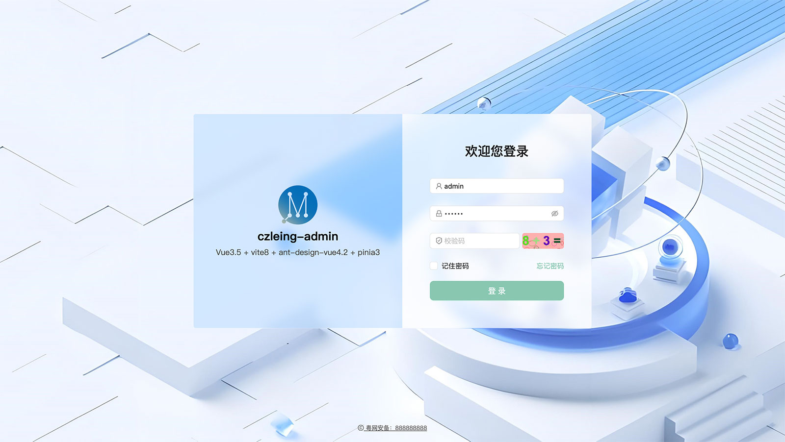
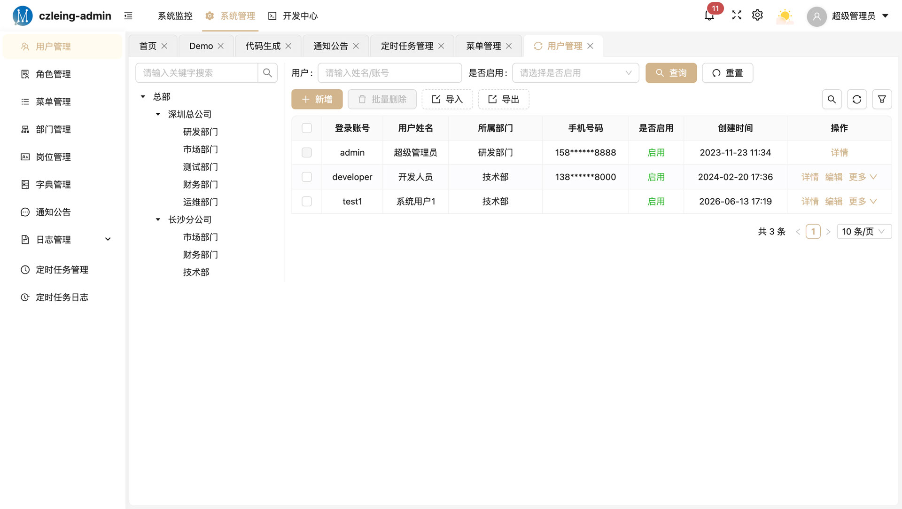
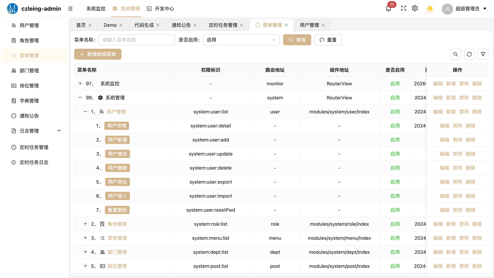
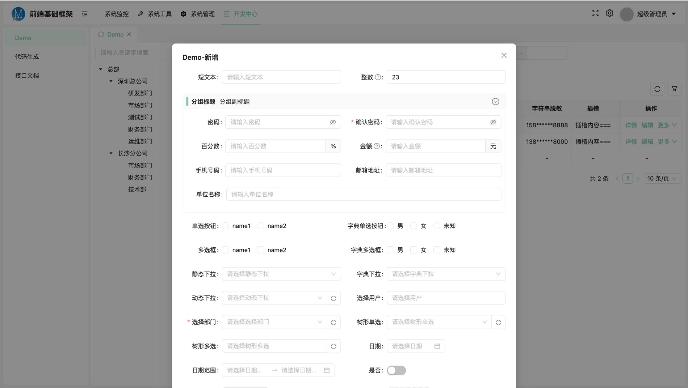
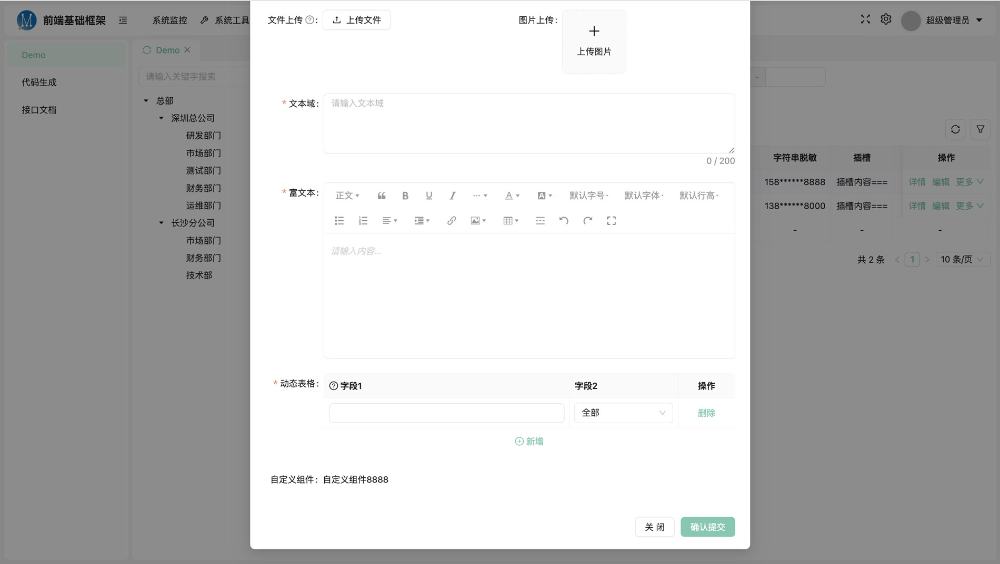
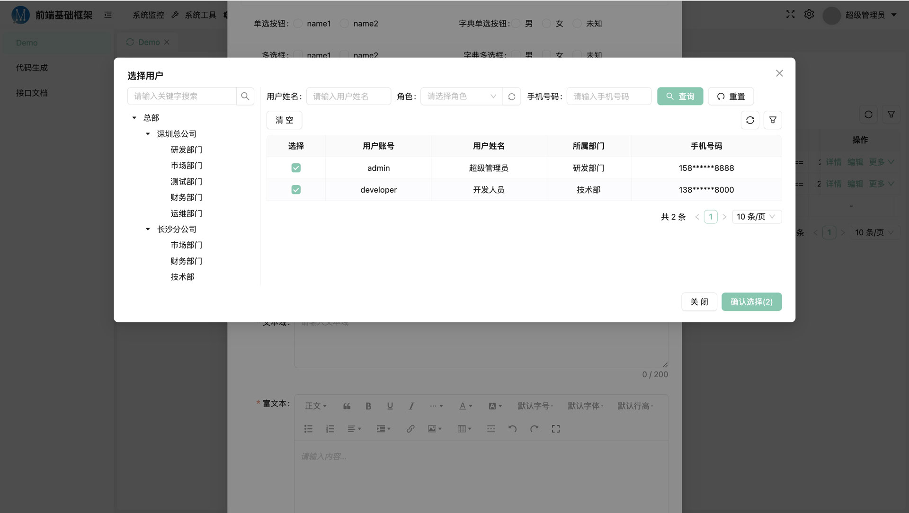
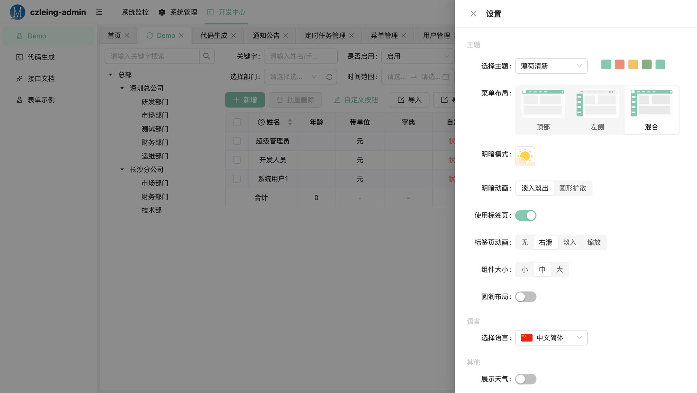
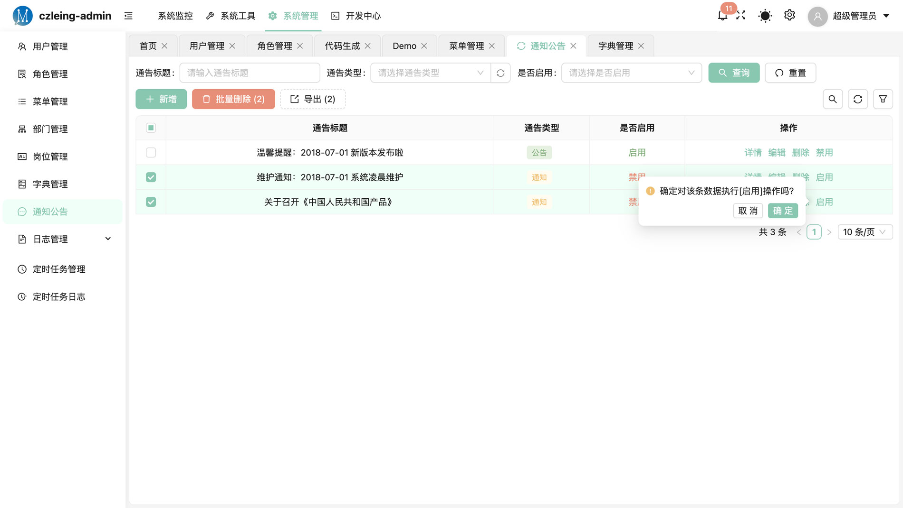
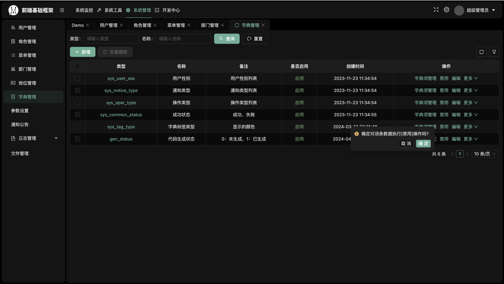
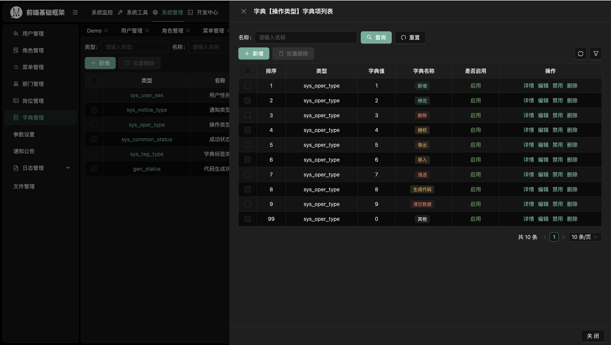
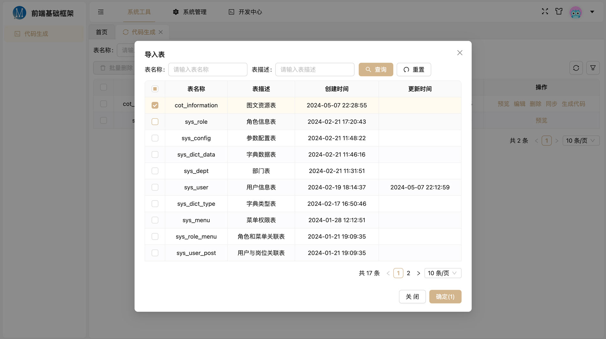
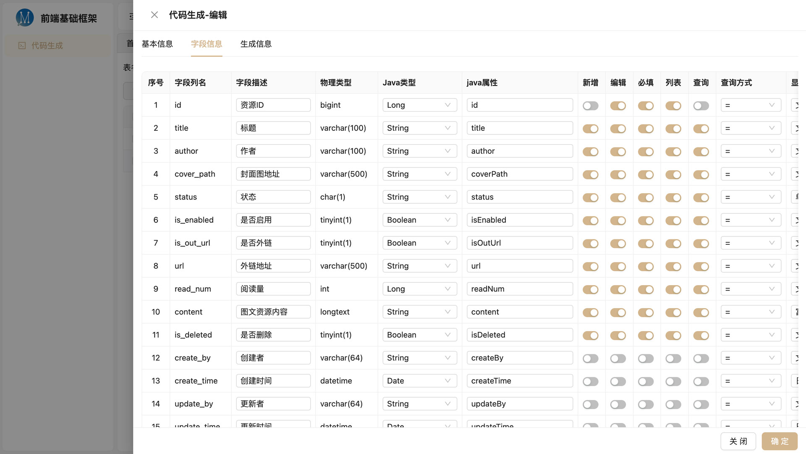
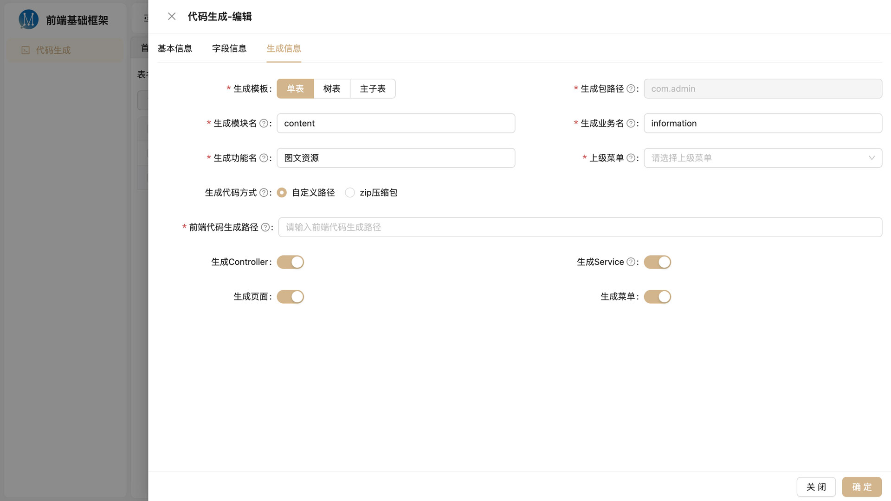
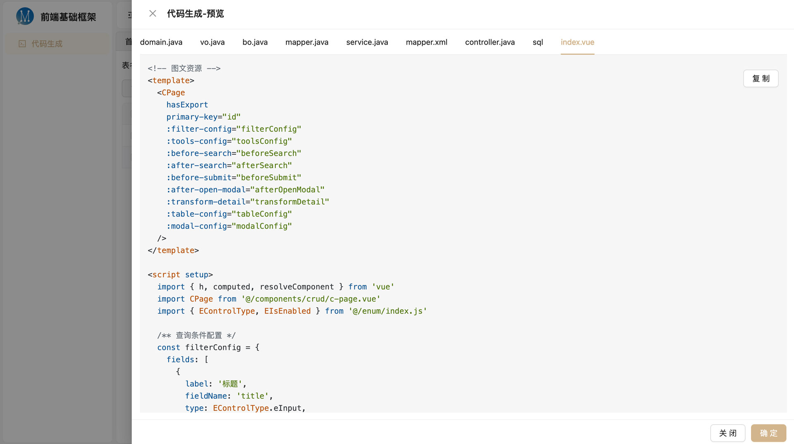

## 文档
[点击进入](./src/doc/README.doc.md)

## 贡献者


czleing

## 感谢支持
开源不易，如果觉得对您有帮助，可以帮忙点个 Star, 感激不尽！

或者还可以小费打赏哦 ^_^

| 微信 | 支付宝 |
| --- | --- |
|||
